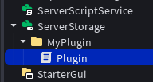

# Beginner Plugin Creation Guide

This guide will walk you through with everything you need to know to create your first plugin!
Follow the steps below, to make your first ever plugin:

**Don't know what Plugins are?**

Head to [the explanation](what-are-plugins.md)

## 1. Basic Setup:-

We will start by first setting up the basics for our plugin.

### 1.1 Folder Creation

Add a Folder inside ServerStorage and name it whatever you want your plugin to be named. Here, we use `MyPlugin`
<p align="right">

</p>

### 1.2 Script Creation

Add a Server Script (script) inside the Folder, name it something like `Plugin`. This is the main script that will make the plugin function like a plugin.

<p align="right">

</p>

### 1.3 Adding the Toolbar and Button

Inside the `Plugin` script, we need to create a **toolbar**. This dedicates a space in the Plugins tab to our plugin.

We can create a toolbar using `plugin:CreateToolbar(name:string)` function. This will create a toolbar with the requested name. You should add this inside a variable, like this:

```luau
local toolbar = plugin:CreateToolbar("MyPlugin")
```

Now with the toolbar created, we can add a button for our Plugin. We can do this with the `toolbar:CreateButton(buttonId:string, tooltip:string, iconname:string, text:string?)`.

You can call the `buttonId` anything, make sure it is not used by other plugins.

The `tooltip` can again be anything, it'll show up when hovering over the button.

`iconname` is the rbxassetid used to display an icon for the button. Type it as: `"rbxassetid://YOUR_ID_HERE"`.

> [!IMPORTANT]
> Even if you don't add an image, just pass an empty string. Passing `nil` or another type will result in an error.

`text` is the string displayed when the image is not provided.

Here is the code snippet for adding the button:

```luau
local button = toolbar:CreateButton("MyPlugin", 
	"My Plugin Tooltip!", 
	"rbxassetid://15523194938", 
	"My First Plugin!")
```

> [!TIP]
> You can add multiple buttons to the same toolbar! Just make sure to reference each one seperately.

### 1.4 Button Functionality

The button we created in 1.3 behaves somewhat similar to GUI Buttons, like TextButton or ImageButton.

We can detect when the button is clicked using the `.Click` event, like this:

```luau
button.Click:Connect(function()
	print("The button was clicked!")
end)
```

Just like UI buttons, we can bind this event to anything with a function call.

### 1.5 Testing the Plugin

Now we have created our first functional plugin, time to test it!

We first have to save it on our computer as a local plugin. To do this, **right-click** on the Folder, and click on **Save/Export**. Now select **Save as Local Plugin** and follow the prompts on screen to save it as an RBXMX file.

Now, open the Plugins tab in Roblox Studio and scroll to the right. You will see your plugin added, behaving as we wanted it.

Everytime we update the Plugin, we can simply save the plugin again to view the changes.

---

## 2. Usage of Selection and ChangeHistoryService:-

There are 2 basic services used by almost all Plugins, being **SelectionService** (or just Selection), and **ChangeHistoryService**.

### 2.1 Selection

Selection, like all other services, can be required by using:

```luau
game:GetService("Selection")
```

`Selection` allows us to get an array containing all instances that are currently selected by the user. This is useful if we want to make a plugin that, for example, changes the shape of all selected BaseParts, or a plugin that converts the parts to the Stud material.

We can use the method below to get an array with the user's selected instances:

```luau
local instances = Selection:Get()
```

Some other events and functions for `Selection` include:

```luau
Selection:Set(array)
```

This highlights the given instances inside the game, basically selecting those instances.

```luau
Selection.SelectionChanged
```

An event that fires whenever the selection for the user changes. If the user selects more instances or unselects instances, it'll fire.

> [!TIP]
> When using `Selection` in your plugins, make sure to update the selection with `Selection:Get()` every time the selection changes with `Selection.SelectionChanged`.

### 2.2 ChangeHistoryService

Ever made a mistake at something? Like a script, or a build? You would probably do `Ctrl + Z` to undo it. This is possible with `ChangeHistoryService`.

ChangeHistoryService allows `Ctrl + Z` Undo and `Ctrl + Y` Redo functions. Start by requiring this Service:

```luau
local ChangeHistoryService = game:GetService("ChangeHistoryService")
```

Now, every time we make a change, we can use the function below to add a Waypoint to it, allowing Undo and Redo.

```luau
ChangeHistoryService:SetWaypoint("Write Anything Here")
```

Replace `'Write Anything Here"` with whatever you want. Make sure it is consistent across the block or thread.

> [!IMPORTANT]
> Call `ChangeHistoryService:SetWaypoint()` once before executing anything and once after the execution is completed. This way the undos actually work.

### 2.3 Practice Plugin

Now that we know how Selection and ChangeHistoryService works, let's make a plugin out of it!
We will make a basic plugin to paint selected parts Red, and include Undos and Redos.

Start by setting up the basics from [chapter 1](#1-basic-setup-), and then follow the steps below:

1. Reference `Selection` and `ChangeHistoryService` in your script.

```luau
local Selection = game:GetService("Selection")
local ChangeHistoryService = game:GetService("ChangeHistoryService")
```

2. Make it so clicking the button gets the currently selected parts and sets a waypoint

```luau
button.Click:Connect(function()
	ChangeHistoryService:SetWaypoint("Paint") -- Set the waypoint before doing anything
	
	local selected = Selection:Get() -- Get the currently selected instances
	...
```

3. Loop through the array of parts and colour the BaseParts red:

```luau
...
for i, part in ipairs(selected) do -- Loop through all the selected instances
		if part:IsA("BasePart") then
			part.Color = Color3.new(1, 0, 0) -- If part is actually a BasePart, change its colour to Red
		end
	end
	...
```

4. Finally, set a last waypoint. Make sure it has the same ID as the first one.

```luau
...
	ChangeHistoryService:SetWaypoint("Paint") -- Set Waypoint again
end)
```

> [!TIP]
> This plugin is available in [Example Plugins](../example-plugins/navigate.md)! Check it out!

Congrats! You've just made another plugin! You can easily expand on this as much as you want.

---

## 3. Widgets
